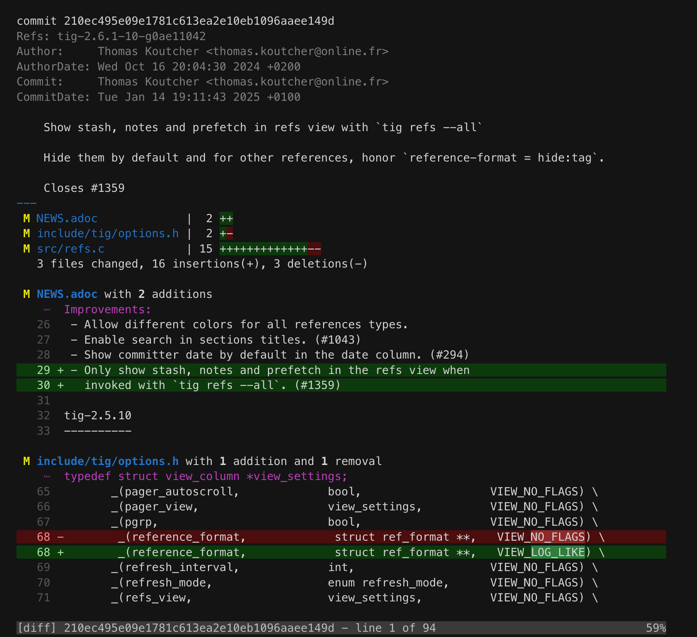

Tig: text-mode interface for Git
================================
:docext: adoc

image:https://github.com/jonas/tig/workflows/Linux/badge.svg[Linux CI,link=https://github.com/jonas/tig/actions?query=workflow%3ALinux]
image:https://github.com/jonas/tig/workflows/macOS/badge.svg[macOS CI,link=https://github.com/jonas/tig/actions?query=workflow%3AmacOS]
image:https://ci.appveyor.com/api/projects/status/jxt1uf52o7r0a8r7/branch/master?svg=true[AppVeyor Build,link=https://ci.appveyor.com/project/fonseca/tig]

What is Tig?
------------
Tig is an ncurses-based text-mode interface for git. It functions mainly
as a Git repository browser, but can also assist in staging changes for
commit at chunk level and act as a pager for output from various Git
commands.

About this fork
---------------
This fork adds a diff view styled after Claude Code: file line numbers,
full-width colored lines, compact file headers with git status letters
and `#rrggbb` colors.

Enable it with:

-----------------------------------------------------------------------------
source contrib/claude-code.tigrc
-----------------------------------------------------------------------------

The config also turns on 'diff-highlight', which pipes diffs through
git's `diff-highlight` script to mark changed words. If the script is
not on your `PATH`, the diff view stays empty and the status line
reports "Failed to run the diff-highlight program". Install it from
git's contrib directory, for example on Debian and Ubuntu:

-----------------------------------------------------------------------------
install -m 755 /usr/share/doc/git/contrib/diff-highlight/diff-highlight ~/.local/bin/
-----------------------------------------------------------------------------

Or disable it with `set diff-highlight = false` after the source line.

See 'diff-gutter', 'diff-fill', 'diff-compact-headers' and 'diff-highlight' in
link:doc/tigrc.5.{docext}[tigrc(5)]. The upstream project is
https://github.com/jonas/tig[jonas/tig].

Resources
---------

 - Homepage:	https://github.com/jonas/tig[]
 - Manual:	https://www.mankier.com/7/tigmanual[]
 - Tarballs:	https://github.com/jonas/tig/releases[]
 - Q&A:		https://stackoverflow.com/questions/tagged/tig[]

Bugs and Feature Requests
-------------------------
Bugs and feature requests can be reported using the
https://github.com/jonas/tig/issues[issue tracker] or by mail to the
https://lore.kernel.org/git/[Git mailing list]. Ensure that the word
"tig" is in the subject. For other Tig related questions please use
Stack Overflow: https://stackoverflow.com/questions/tagged/tig[].

If you are sending a bug report, please include the following information:

- What Tig and ncurses versions are you using?
  (`tig -v`)
- What system do you have?
  (`uname -a`, `lsb_release -a`)
- What Git version are you using?
  (`git -v`)

Installation and News
---------------------

Information on how to build and install Tig are found in
link:INSTALL.{docext}[the installation instructions].

News about releases and latest features and bug fixes are found in
link:NEWS.{docext}[the release notes].
